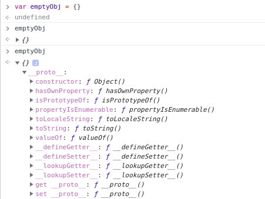
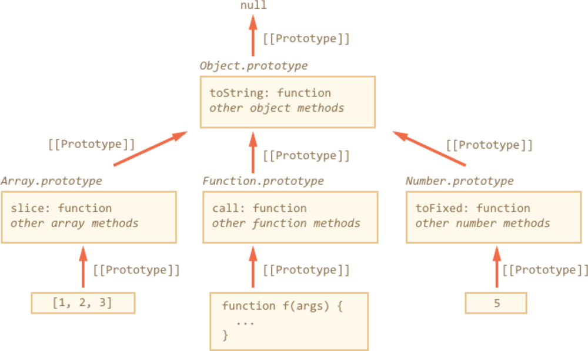
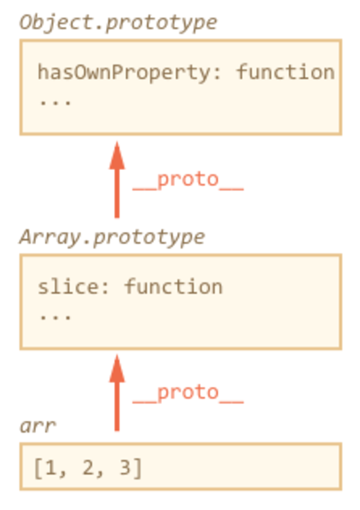

import { Head, Code, Appear, components as Components } from 'mdx-deck'
import { FullscreenCode, Split, SplitRight } from 'mdx-deck/layouts'
import ImageWithLabel from './components/image-with-label'

export { default as theme } from './theme'

<Head>
  <title>JavaScript Prototypal Inheritance</title>
</Head>

# JavaScript Prototypal Inheritance

Author: Artem Ovcharenko

Slides: https://akovcharenko.github.io/Prototypal-Inheritance

Workshop repo: https://akovcharenko.github.io/Prototypal-Inheritance-workshop

---

```js
var user = {
    id: 1782,
    created: Date.now(),
    banned: false,
    hasAccessTo: defaultAccessList,
    allowComments: true,
    comments: getUserComments(1782),
}

---

## Constructor

Constructor is a function which creates an "instance".

```js
function createUser(userId, getUserComments, defaultAccessList) {
    return {
        id: userId,
        created: Date.now(),
        banned: false,
        hasAccessTo: defaultAccessList,
        allowComments: true,
        comments: getUserComments(userId),
    };
}

---

## Constructor

Constructor is a function which creates an "instance", but via 'new' keyword.

```js
function User(id) {
    function getUserComments(id) {
       //smth;
    }

    this.id = id;
    this.created = Date.now();
    this.banned = false;
    this.allowComments = true;
    this.hasAccessTo = defaultAccessList;
    this.comments = getUserComments(id);
}

var user = new User(1782);

---

export default Split

<div>
  <Components.h2>
    What is <Components.inlineCode>this</Components.inlineCode>?
  </Components.h2>
  <Components.p>The JavaScript <Components.inlineCode>this</Components.inlineCode> keyword(in most cases) refers to the object, and value determined by how a function is called.</Components.p>
  <br />
  <Components.ol>
    <Components.li>
      In a method, <Components.inlineCode>this</Components.inlineCode> refers to the owner object.
    </Components.li>
    <Components.li>
      In a function, <Components.inlineCode>this</Components.inlineCode> refers to window.
    </Components.li>
    <Components.li>
     In a function, in strict mode, <Components.inlineCode>this</Components.inlineCode> is undefined.
    </Components.li>
    <Components.li>
      In a constructor <Components.inlineCode>this</Components.inlineCode> refers to created instance.
    </Components.li>
    <Components.li>
     In an event, <Components.inlineCode>this</Components.inlineCode> refers to the element that received the event.
    </Components.li>
    <Components.li>
      Methods like call(), and apply() can refer <Components.inlineCode>this</Components.inlineCode> to any object.
    </Components.li>
  </Components.ol>
</div>

```js
    1. obj.method(); //this -> obj;

    2. myBestFunc(); //this -> window;

    3.
       'use strict'
       myBestFunc(); //this -> undefined;

    4. new User; //this -> User instance;

    5. document.querySelector('textarea').onBlur(myBestFunc);
       //this -> blured textarea;

    6. obj.method.call(anotherObj); //this -> anotherObj;

---

## With 'new' or without

```js
var firstUser = new User(1); // User
var secondUser = User(2); // undefined

---

## Defined return

1. function returns primitive - constructor ignores return, and returns `this`.
2. function returns object - `this` will be ignored, and object returned.

---

## Singleton

```js
var firstInstance = new Singleton;
var secondInstance = new Singleton;

firstInstance === secondInstance // true;

---

```js
function User(id) {
    this.id = id;
    this.created = Date.now();
    this.banned = false;
    this.allowComments = true;
    this.comments = this.getUserComments();
    this.getUserComments = function() {
        //smth;
    }
    this.hasAccessTo = defaultAccessList;
    this.banUser = function() {
        this.banned = true;
    };
    this.unBanUser = function() {
        this.banned = false;
    };
}

---

```js
var emptyObj = {};

---

```js
var emptyObj = {};

emptyObj.toString // ƒ toString() { [native code] }
emptyObj.toString() // '[object Object]'

---

```js
var five = 5;

---

```js
var five = 5;

five.toString // ƒ toString() { [native code] }
five.toString() // '5'

---

<ImageWithLabel>
  
</ImageWithLabel>

---

<ImageWithLabel>
  
</ImageWithLabel>

---

## Task 2

1. Object.prototype.toString should returns
    ```js
        `Big Brother watching You! ${defaultMethodResult}`
    ```

2. Add to the prototype of all functions the method defer(ms), that runs the function after ms milliseconds.
---

```js
function User(id) {
    this._id = id;
    this._created = Date.now();
    this._banned = false;
    this.allowComments = true;
}

User.prototype = {
    constructor: User,
    hasAccessTo: defaultAccessList,
    unBanUser: function() { this.banned = false; },
    banUser: function() { this.banned = true; },
    getUserComments: function() { //smth; }
}

---

```js
var admin = {
    id: id;
    created: Date.now(),
    banned: false,
    allowComments: true,
    unBanUser: function() { this.banned = false; },
    banUser: function() { this.banned = true; },
    getUserComments: function() { //smth; },
    hasAccessTo: adminAccessList,
    deleteComments: function() { //smth; },
    closeProject: function() { //smth; },
    deleteTicket: function() { //smth; }
}

---

```js
function Admin(id) {
    this._id = id;
    this._created = Date.now();
    this._banned = false;
    this.allowComments = true;
}

Admin.prototype = {
    constructor: Admin,
    hasAccessTo: adminAccessList,
    unBanUser: function() {
        this.banned = false;
    },
    banUser: function() {
        this.banned = true;
    },
    getUserComments: function() { //smth; },
    hasAccessTo: adminAccessList,
    deleteComments: function() { //smth; },
    closeProject: function() { //smth; },
    deleteTicket: function() { //smth; }
}

---

<ImageWithLabel>
  
</ImageWithLabel>

---

```js

admin instance -> Admin.prototype -> User.prototype

---

## Object.create

```js
Object.create(protoObject); // {__proto__: protoObject}

---

## Prototypal Chaning

```js
Admin.prototype = Object.create(User.prototype);

---

```js
    function Admin(id) {
        this._id = id;
        this._created = Date.now();
        this._banned = false;
        this.allowComments = true;
    }

    Admin.prototype = Object.create(User.prototype);
    Object.assign(
        Admin.prototype,
        {
            constructor: Admin,
            hasAccessTo: adminAccessList,
            deleteComments: function() { //smth; },
            closeProject: function() { //smth; },
            deleteTicket: function() { //smth; }
        }
    )

---

```js
    function Admin(id) {
        User.apply(this, arguments);
    }

    Object.assign(
        Admin.prototype,
        {
            constructor: Admin,
            hasAccessTo: adminAccessList,
            deleteComments: function() { //smth; },
            closeProject: function() { //smth; },
            deleteTicket: function() { //smth; }
        }
    )

---

## Task 3

1. Create Class SuperHero which takes arguments: team, name, power, exp.
2. Hero instance should has methods:
    - greet: returns string - hello there! my name is `name`, and I am `team`'s team member.
    - kickAsses: returns string - I kick asses with power `power`.
    - manageTheTeam: returns string - I manage `team` team, with experience `exp`.

---
## Task 4

1. Create Class Wuss which takes arguments: team, name, power, exp.
2. Wuss Class instance should inherits SuperHero Class, and should has methods:
    - greet: returns string - hello there! my name is `name`, and I am `team`'s team member.
    - kickAsses: returns string - I can not kick asses :'(, my power is `power`.
    - manageTheTeam: returns string - I manage `team` team, with experience `exp`.

---

## Task 5

1. Create Class Berserker which takes arguments: team, name, power, exp.
2. Berserker Class instance should inherits SuperHero Class, and should has methods:
    - greet: returns string - hello there! my name is `name`, and I am `team`'s team member.
    - kickAsses: returns string - I kick asses with power `power`.
    - manageTheTeam: returns string - I can not manage team, I am too strong for this, my power is `power`.

---

## Task 6

1. Create Class Imba which takes arguments: team, name, power, exp.
2. Imba Class instance should inherits SuperHero Class, and should has methods:
    - greet: returns string - hello there! my name is `name`, and I am `team`'s team member.
    - kickAsses: returns string - I kick asses with power `power`.
    - manageTheTeam: returns string - I manage `team` team, with experience `exp`.
    - doAnything: returns string - I can do anything, because I am imba.

---

## Mixin in javaScript

 Mixin in javaScript is a object or function that contains methods for use by classes.

---

## Mixin as an object

```js
    var messageMixin = {
        sendMessage: function() { sendMessageRequest(this.id) },
        deleteAllMessages: function() { deleteAllMessages(this.id) }
    };

    Object.assign(User.prototype, messageMixin);
---

## Mixin as a function

```js
    var messageMixin = function() {
        this.sendMessage  = function() { sendMessageRequest(this.id) };
        this.deleteAllMessages = function() { deleteAllMessages(this.id) };

        return this;
    };

    messageMixin.call(User.prototype);
---

## ES6 Classes. `Class`

---

```js
    class SuperHero {

      constructor(name) {
        this.name = name;
      }

      greet() {
        alert(`hello there! it is me - ${this.name}.`);
      }

    }

    let deadPool = new SuperHero('Deadpool');
    deadPool.greet(); // hello there! it is me - Deadpool.

---

## Difference with ES5

    1. Can not be executed without `new`.
    2. All methods from prototype will not be present in for..in loop.
    3. All methods work in strict mode.
    4. You can not put property to prototype(during class initialization).
    5. Class behaves like let variable.

---

## ES6 Class Inheritance. `extends`

---

    ```js

    class User {
      constructor(id) {
        this.id = id;
      }

      unBanUser() { this.banned = false; },
      banUser() { this.banned = true; },
      getUserComments() { //smth; }
    }

    class Admin extends User {
        constructor(id) {
            super(id);
            this.adminFor = 'appformix';
        }

        deleteComments: function() { //smth; },
        closeProject: function() { //smth; },
        deleteTicket: function() { //smth; }
    }

    ```
---

## Questions

---

### Thank you for your participation.
