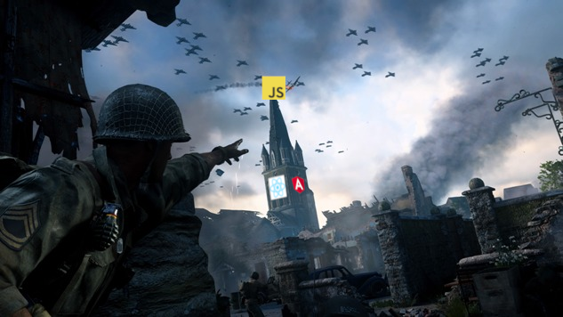

import { Head, Code, Appear, components as Components } from 'mdx-deck'
import { FullscreenCode, Split, SplitRight } from 'mdx-deck/layouts'
import ImageWithLabel from './components/image-with-label'

export { default as theme } from './theme'

<Head>
  <title>JavaScript Prototypal Inheritance</title>
</Head>

# JavaScript Prototypal Inheritance

Author: Artem Ovcharenko

Slides: https://akovcharenko.github.io/Prototypal-Inheritance

Workshop repo: https://akovcharenko.github.io/Prototypal-Inheritance-workshop

---

```js
var user = {
    id: 1782,
    created: Date.now(),
    banned: false,
    hasAccessTo: defaultAccessList,
    allowComments: true,
    comments: getUserComments(1782),
}

---

## Constructor

Constructor is a function which creates an "instance".

```js
function createUser(userId, getUserComments, defaultAccessList) {
    return {
        id: userId,
        created: Date.now(),
        banned: false,
        hasAccessTo: defaultAccessList,
        allowComments: true,
        comments: getUserComments(userId),
    };
}

---

## Constructor

Constructor is a function which creates an "instance", but via 'new' keyword.

```js
function User(id) {
    function getUserComments(id) {
       //smth;
    }

    this.id = id;
    this.created = Date.now();
    this.banned = false;
    this.allowComments = true;
    this.hasAccessTo = defaultAccessList;
    this.comments = getUserComments(id);
}

var user = new User(1782);

---

## what is `this`?

The JavaScript `this` keyword refers to the object it belongs to.

1. In a method, `this` refers to the owner object.
```js
    obj.method(); //this -> obj;
```
2. In a function, `this` refers to window.
```js
    myBestFunc(); //this -> window;
```
3. In a function, in strict mode, `this` is undefined.
```js
    'use strict'
    myBestFunc(); //this -> undefined;
```
4. In a constructor `this` refers to created instance.
```js
    new User; //this -> User instance;
```
5. In an event, `this` refers to the element that received the event.
6. Methods like call(), and apply() can refer this to any object.
```js
    obj.method.call(anotherObj); //this -> anotherObj;
```

---

## With 'new' or without

```js
var firstUser = new User(1); // User
var secondUser = User(2); // undefined

---

## Defined return

1. function returns primitive - constructor ignores return, and returns `this`.
2. function returns object - `this` will be ignored, and object returned.

---

## Singleton

```js
var firstInstance = new Singleton;
var secondInstance = new Singleton;

firstInstance === secondInstance // true;

---

```js
function User(id) {
    this.id = id;
    this.created = Date.now();
    this.banned = false;
    this.allowComments = true;
    this.comments = this.getUserComments();
    this.getUserComments = function() {
        //smth;
    }
    this.hasAccessTo = defaultAccessList;
    this.banUser = function () {
        this.banned = true;
    };
    this.unBanUser = function () {
        this.banned = false;
    };
}

---

```js
var emptyObj = {};

---

```js
var emptyObj = {};

emptyObj.toString // ƒ toString() { [native code] }
emptyObj.toString() // '[object Object]'

---

```js
var five = 5;

---

```js
var five = 5;

five.toString // ƒ toString() { [native code] }
five.toString() // '5'

---

<ImageWithLabel>
  
</ImageWithLabel>

---

<ImageWithLabel>
  
</ImageWithLabel>

---

```js
function User(id) {
    this._id = id;
    this._created = Date.now();
    this._banned = false;
    this.allowComments = true;
}

User.prototype = {
    hasAccessTo: defaultAccessList,
    unBanUser: function () {
        this.banned = false;
    },
    banUser: function () {
        this.banned = true;
    },
    getUserComments: function() {
        //smth;
    }
}

---

## Questions

---

### Thank you for your participation.

<ImageWithLabel label="Jak żyć na froncie?">
  
</ImageWithLabel>

```notes
On 01/14/2019 there is going to be a workshop on prototypal inheritance in Javascript.
```